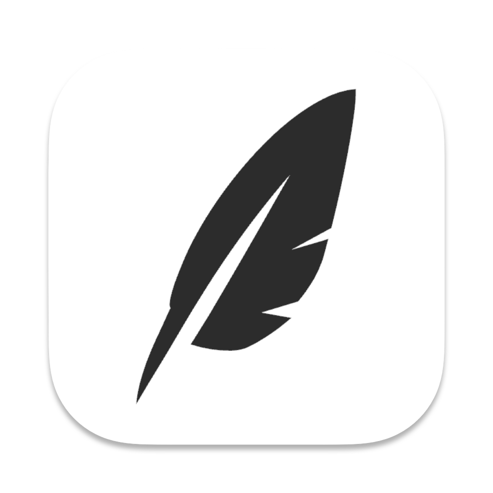

<div align="center">

# ClipHarbor



[](https://github.com/yurentle/ClipHarbor/releases)
[](https://github.com/yurentle/ClipHarbor/stargazers)

A Modern Cross-Platform Clipboard Manager

[简体中文](./README.md) | English

</div>

## ✨ Features

- 🔄 **Smart Clipboard History**: Automatically save and manage clipboard history, supporting text and images
- 🎯 **Quick Search**: Powerful search functionality for fast history location
- ⌨️ **Shortcut Support**: Customizable shortcuts for quick access to clipboard history
- 🎨 **Modern Interface**: Beautiful interface based on Mantine UI
- 🔒 **Privacy Protection**: Local storage ensures data security
- 🔄 **Cloud Sync**: Support syncing clipboard history to cloud storage via rclone
- 🌍 **Cross-platform**: Support for macOS, Windows, and Linux

## 📦 Installation

### Download Packages

Visit [GitHub Releases](https://github.com/yurentle/ClipHarbor/releases) to download the latest version:

- **macOS**: `.dmg` (Intel/Apple Silicon)
- **Windows**: `.exe` (Installer) or `.zip` (Portable)
- **Linux**: `.AppImage` or `.deb`

### Build from Source

```bash
# Clone repository
git clone https://github.com/yurentle/ClipHarbor.git
cd ClipHarbor

# Install dependencies
pnpm install

# Run in development mode
pnpm dev

# Build application
pnpm build
```

## 🚀 Usage

1. **Launch**: Start the app after installation, it will show an icon in the system tray
2. **Copy**: Use system copy function as usual (Ctrl+C/Command+C)
3. **View History**: 
   - Click the tray icon to open main interface
   - Use keyboard shortcut to open main interface (default: `Command/Ctrl+Shift+V`)
4. **Search**: Enter keywords in the search box to quickly find items
5. **Use Content**: Click on history items or use shortcuts for quick paste

## 🤝 Contributing

Contributions are welcome! Feel free to contribute code, report issues, or suggest improvements! Please check our [Contributing Guide](CONTRIBUTING.md).

## 📄 License

ClipHarbor is licensed under the MIT License.

## 🔄 Cloud Sync Configuration

### Rclone Sync
ClipHarbor supports backing up your clipboard history to cloud storage using rclone. Here's how to set it up:

1. Install rclone and configure remote storage
   ```bash
   # Install rclone
   brew install rclone  # macOS
   # Or visit https://rclone.org/install/ for other installation methods
   
   # Configure remote storage
   rclone config
   ```

2. In ClipHarbor settings:
   - Open settings window
   - Enter your rclone config name in the sync settings section
   - Click save, and your clipboard history will automatically sync to the cloud

For more information about rclone configuration, visit [rclone.org](https://rclone.org/)
